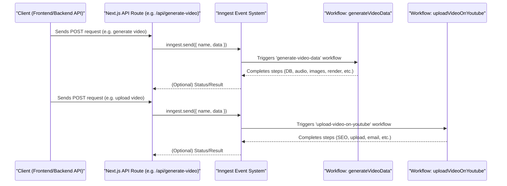

# VidFlow: The YouTube Automation Platform

VidFlow is a modern, full-stack platform designed to automate YouTube content creation, management, and publishing. Built with Next.js, Remotion, and a suite of cloud and AI tools, VidFlow streamlines the process of generating, editing, and uploading videos to YouTube, making it ideal for creators, agencies, and businesses.

## Features

- **Automated Video Generation**: Generate scripts and videos using AI-powered endpoints.
- **YouTube Integration**: Connect your YouTube account, upload videos, and manage your channel directly from the dashboard.
- **Remotion Video Rendering**: Leverage Remotion for dynamic video composition and previews.
- **User Authentication**: Secure sign-in/sign-up flows with OAuth support (Google).
- **Dashboard & Analytics**: Manage your videos, view progress, and access channel guides.
- **Customizable Video Styles**: Choose from various video styles (anime, cartoon, cinematic, etc.).
- **Email Notifications**: Receive updates when videos are uploaded.

## Folder Structure

```
app/                # Next.js app directory (routes, pages, API, layouts)
  (auth)/           # Authentication pages (sign-in, sign-up)
  (main)/           # Main app pages (dashboard, videos, YouTube integration)
  api/              # API routes (video generation, upload, OAuth, etc.)
components/         # Reusable React components (UI, templates, theme)
constants/          # Static data and prompt templates
hooks/              # Custom React hooks
lib/                # Library code (API clients, utils, env, AI integrations)
public/             # Static assets (images, favicons, logos)
remotion/           # Remotion video composition and rendering
prisma/             # Database schema and migrations
```

## Setup & Installation

1. **Clone the repository:**

   ```bash
   git clone https://github.com/yourusername/vidflow-the-youtube-automation-platform.git
   cd vidflow-the-youtube-automation-platform
   ```

2. **Install dependencies:**

   ```bash
   npm install
   # or
   yarn install
   ```

3. **Configure environment variables:**
   - Copy `.env.example` to `.env` and fill in the required values (database, Google OAuth, AWS, etc.).

4. **Run database migrations:**

   ```bash
   npm run postinstall
   npm run migrate:dev
   ```

5. **Start the development server:**

   ```bash
   npm run dev
   # or
   yarn dev
   ```

6. **Access the app:**
   - Open [http://localhost:3000](http://localhost:3000) in your browser.

## Usage

- **Sign in** with your Google account.
- **Connect your YouTube channel** via the dashboard.
- **Generate scripts and videos** using the AI-powered tools.
- **Preview and edit videos** with Remotion.
- **Upload videos** directly to your YouTube channel.
- **Manage your content** and view analytics from the dashboard.

## Technologies Used

- **Next.js** (App Router)
- **React**
- **Remotion** (video rendering)
- **Prisma** (ORM)
- **PostgreSQL** (or your configured DB)
- **Google OAuth**
- **AWS** (for storage, if configured)
- **OpenAI / Gemini** (AI integrations)
- **Tailwind CSS** (via globals.css)

## Architecture: Client, Inngest, and Workflows

Below is a high-level diagram showing how the client, API, Inngest, and Inngest workflows interact:



## Contributing

Contributions are welcome! Please open issues or submit pull requests for new features, bug fixes, or improvements.

1. Fork the repository
2. Create your feature branch (`git checkout -b feature/YourFeature`)
3. Commit your changes (`git commit -m 'Add some feature'`)
4. Push to the branch (`git push origin feature/YourFeature`)
5. Open a pull request

## Remotion Docs

For more information about Remotion, see the following official resources:

- [Remotion Homepage](https://www.remotion.dev/)
- [Remotion Documentation](https://www.remotion.dev/docs/)
- [Remotion Player Examples](https://www.remotion.dev/docs/player/examples)
- [Remotion Lambda Setup](https://www.remotion.dev/docs/lambda/setup)
- [Remotion Cloud Run Setup](https://www.remotion.dev/docs/cloudrun/setup)

## License

This project is licensed under the MIT License. See the [LICENSE](LICENSE) file for details.
